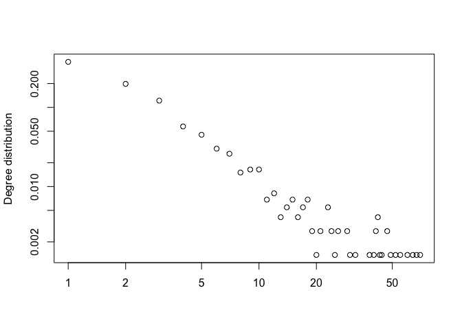

<!-- README.md is generated from README.Rmd. Please edit that file -->

# simdynet

The goal of simdynet is to simulate realistic dynamic sexual networks.

## Installation

You can install simdynet from github with:

``` r
devtools::install_github("lwhittles/simdynet")
```

The package can then be loaded using:

``` r
library(simdynet)
```

## Example

This is a basic example of usage. To generate a dynamic network in a
population of size 1000, and such that the degree distribution over a
year follows a power law distribution with exponent 1.8, we can use:

``` r
test <- sim_dynamic_sn(N = 1000, gamma = 1.8)
plot(test$dd,xlab = '',ylab = 'Degree distribution',log = 'xy')
```

<!-- -->

## More information and getting help

For more detailed examples of how to use simdynet, see the vignette
[here](https://github.com/lwhittles/simdynet/tree/master/vignettes). See
also the help included in the package using the R command
`help(package='simdynet')`.

If you have any problem or question please create an issue
[here](https://github.com/lwhittles/simdynet/issues) or get in touch by
emailing `l.whittles14@imperial.ac.uk` or `xavier.didelot@gmail.com`
